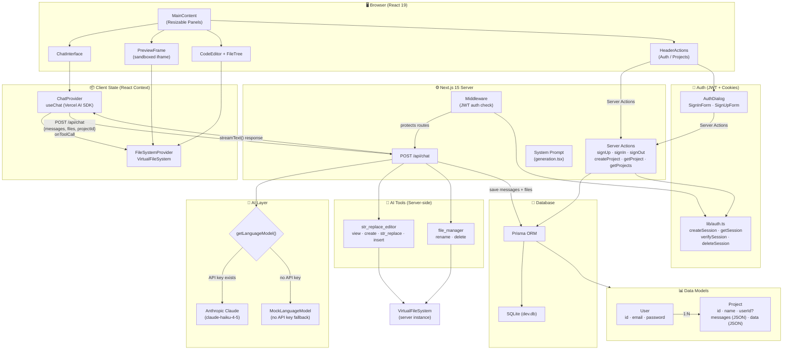
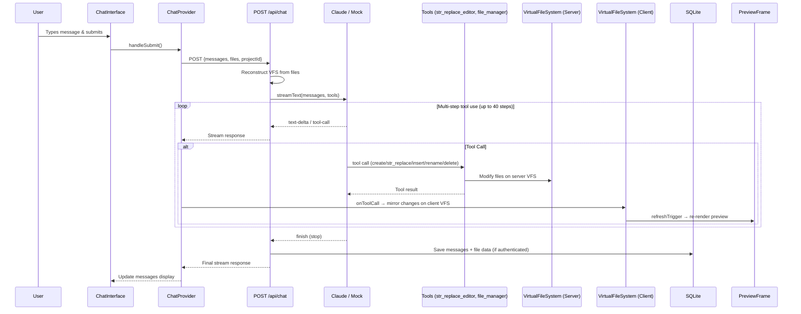

# UIGen Architecture Diagram

## System Overview



## Request Flow: User Sends a Chat Message



## File System & Preview Pipeline

```mermaid
flowchart LR
    subgraph VFS["VirtualFileSystem"]
        Files["In-memory file tree<br/>(Map&lt;path, FileNode&gt;)"]
    end

    subgraph Transform["JSX Transformer"]
        Babel["@babel/standalone<br/>JSX → JS"]
        ImportMap["createImportMap()<br/>blob URLs"]
    end

    subgraph Iframe["Sandboxed iframe"]
        HTML["Generated HTML<br/>+ import map<br/>+ Tailwind CDN<br/>+ React CDN"]
    end

    Files -->|getAllFiles()| Transform
    Transform -->|createPreviewHTML()| Iframe
```

## Directory Structure

```
uigen/
├── prisma/                  # Database schema & migrations
│   ├── schema.prisma        # User + Project models
│   └── dev.db               # SQLite database
├── src/
│   ├── actions/             # Server Actions (auth + CRUD)
│   ├── app/
│   │   ├── api/chat/        # AI chat endpoint (streaming)
│   │   ├── [projectId]/     # Project page (authenticated)
│   │   ├── page.tsx         # Home (anon or redirect)
│   │   ├── main-content.tsx # Main UI layout
│   │   └── layout.tsx       # Root layout
│   ├── components/
│   │   ├── auth/            # SignIn/SignUp dialogs
│   │   ├── chat/            # Chat UI (messages, input, markdown)
│   │   ├── editor/          # Code editor + file tree
│   │   ├── preview/         # Live preview iframe
│   │   └── ui/              # shadcn/ui primitives
│   ├── hooks/               # useAuth hook
│   ├── lib/
│   │   ├── contexts/        # ChatProvider, FileSystemProvider
│   │   ├── prompts/         # System prompt for AI
│   │   ├── tools/           # AI tool definitions
│   │   ├── transform/       # JSX → browser-ready JS
│   │   ├── auth.ts          # JWT session management
│   │   ├── file-system.ts   # VirtualFileSystem class
│   │   ├── prisma.ts        # Prisma client singleton
│   │   └── provider.ts      # LLM provider (Claude or Mock)
│   └── middleware.ts         # Route protection
└── package.json
```
